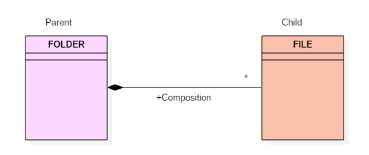
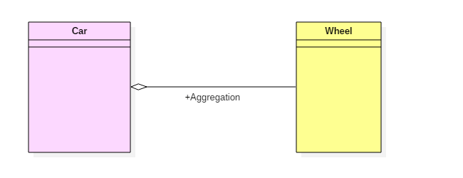

# Наследование, композиция, агрегация
## Наследование
Наследование — это когда класс-наследник имеет все поля и методы родительского класса, и, как правило, добавляет какой-то новый функционал или/и поля. Наследование описывается словом «является». Легковой автомобиль является автомобилем. Вполне естественно, если он будет его наследником.

## Ассоциация
это когда один класс включает в себя другой класс в качестве одного из полей. Ассоциация описывается словом «имеет». Автомобиль имеет двигатель. Вполне естественно, что он не будет являться наследником двигателя (хотя такая архитектура тоже возможна в некоторых ситуациях).

Выделяют два частных случая ассоциации: композицию и агрегацию.

### Композиция
Композиция – это когда двигатель не существует отдельно от автомобиля. Он создается при создании автомобиля и полностью управляется автомобилем. В типичном примере, экземпляр двигателя будет создаваться в конструкторе автомобиля.

### Агрегация
Агрегация – это когда экземпляр двигателя создается где-то в другом месте кода, и передается в конструктор автомобиля в качестве параметра.
