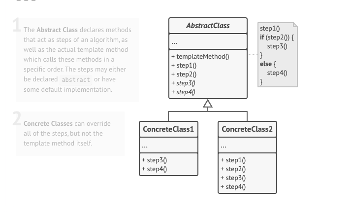

# Шаблонный метод

это поведенческий паттерн проектирования, который определяет скелет алгоритма, перекладывая ответственность за некоторые его шаги на
подклассы. Паттерн позволяет подклассам переопределять шаги алгоритма, не меняя его общей структуры.

## Применимость

-  Когда подклассы должны расширять базовый алгоритм, не меняя его структуры.
- Когда у вас есть несколько классов, делающих одно и то же с незначительными отличиями. Если вы редактируете один класс, то приходится вносить такие же правки и в остальные классы.
- 